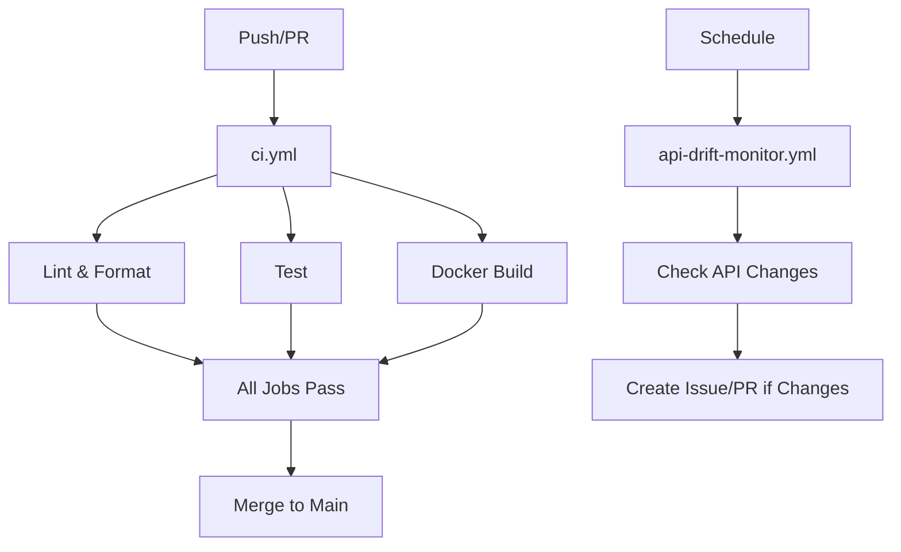

# JustiFi MCP Server CI/CD Workflows

This directory contains the CI/CD pipeline for the JustiFi MCP Server. The workflows ensure code quality and reliable functionality.

## Workflow Overview

### 1. Main CI Pipeline (`ci.yml`)
**Triggers:** Push to main, Pull requests, Manual dispatch

**Jobs:**
- **Lint & Format**: Runs ruff linting and formatting checks
- **Test**: Unit tests with pytest and coverage reporting
- **Docker Build**: Validates development Docker image builds

**Features:**
- Python 3.11 testing on Ubuntu
- Code coverage reporting via Codecov
- Docker image validation
- Fail-fast on critical errors

### 2. API Drift Monitor (`api-drift-monitor.yml`)
**Triggers:** Weekly schedule (Monday 9 AM UTC), Manual dispatch

**Jobs:**
- **Check API Drift**: Monitors JustiFi API for changes
- **Create Issue**: Automatic issue creation for detected changes
- **Create Pull Request**: Automated PR for API specification updates

**Features:**
- Weekly API monitoring
- Automatic issue and PR creation
- Change detection and reporting

## Configuration Files

### Dependabot (`dependabot.yml`)
- **Python dependencies**: Weekly updates
- **GitHub Actions**: Weekly updates
- **Auto-labeling**: Automatic PR labeling
- **Team reviews**: Assigns to mcp-team

## Workflow Dependencies



## Environment Variables

The workflows use the following environment variables:

- `JUSTIFI_CLIENT_ID`: JustiFi API client ID
- `JUSTIFI_CLIENT_SECRET`: JustiFi API client secret
- `JUSTIFI_ENABLED_TOOLS`: Tools to enable (default: all)
- `GITHUB_TOKEN`: GitHub Actions token (automatic)

## Artifacts and Reports

Each workflow generates relevant artifacts:

- **Test Results**: Coverage reports, test outputs
- **Build Artifacts**: Docker images, test results

## Best Practices

1. **Code Quality**: Automated linting and formatting
2. **Testing**: Comprehensive unit test coverage
3. **Docker Validation**: Ensure containers build properly
4. **API Monitoring**: Track external API changes
5. **Automated Dependencies**: Regular updates with safety checks

## Monitoring and Alerts

- **PR Status Checks**: Required status checks for PR merging
- **Issue Creation**: Automatic issue creation for drift detection
- **Coverage Reports**: Test coverage tracking via Codecov

## Usage Examples

### Manual CI Run
```bash
# Navigate to Actions tab
# Select "CI" workflow
# Click "Run workflow"
# Select branch
# Click "Run workflow"
```

### Manual API Drift Check
```bash
# Navigate to Actions tab
# Select "API Drift Monitor" workflow
# Click "Run workflow"
# Click "Run workflow"
```

## Troubleshooting

### Common Issues

1. **Test Failures**: Check the test results artifacts
2. **Linting Errors**: Run `make lint` and `make format` locally
3. **Docker Build Failures**: Verify Dockerfile and dependencies
4. **API Drift**: Check API compatibility and update tools

### Debug Steps

1. Check workflow logs in GitHub Actions
2. Review artifacts for detailed reports
3. Run tests locally using Makefile commands:
   ```bash
   make lint    # Run linting checks
   make format  # Auto-format code
   make test    # Run all tests
   ```
4. Verify environment variables and secrets

## Contributing

When adding new workflows:

1. Follow the existing naming conventions
2. Include comprehensive error handling
3. Add proper documentation
4. Use appropriate triggers and permissions
5. Keep workflows focused and efficient

## Support

For questions or issues with the CI/CD pipeline:

1. Check the workflow logs
2. Review this documentation
3. Create an issue with the `ci` label
4. Tag the `@justifi-tech/mcp-team`