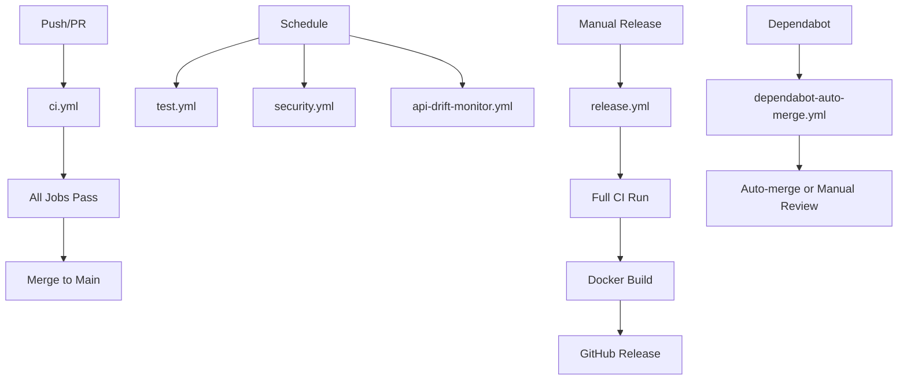

# JustiFi MCP Server CI/CD Workflows

This directory contains the comprehensive CI/CD pipeline for the JustiFi MCP Server. The workflows are designed to ensure code quality, security, and reliable deployments.

## Workflow Overview

### 1. Main CI/CD Pipeline (`ci.yml`)
**Triggers:** Push to main, Pull requests, Manual dispatch

**Jobs:**
- **Lint & Format**: Runs ruff linting and formatting checks
- **Security Scan**: Basic security scanning with safety and bandit
- **Unit Tests**: Cross-platform testing (Ubuntu, Windows, macOS) with Python 3.11 and 3.12
- **Integration Tests**: MCP server functionality and Docker integration tests
- **Docker Build**: Validates both development and production Docker images
- **API Drift Check**: Monitors for JustiFi API changes (PR only)
- **Build Summary**: Generates comprehensive build status report

**Features:**
- Matrix testing across multiple OS and Python versions
- Comprehensive test coverage reporting
- Docker image validation
- Fail-fast on critical errors
- Detailed build summaries

### 2. Comprehensive Test Suite (`test.yml`)
**Triggers:** Daily schedule (2 AM UTC), Manual dispatch

**Jobs:**
- **Performance Tests**: Benchmarking and memory profiling
- **Extended Integration Tests**: Comprehensive server and tool testing
- **Security Deep Scan**: Thorough security analysis with multiple tools
- **API Compatibility Tests**: MCP protocol and API compatibility validation

**Features:**
- Configurable test types (all, performance, integration, security, api)
- Performance benchmarking with pytest-benchmark
- Memory usage profiling
- Deep security scanning with multiple tools

### 3. Security Scanning (`security.yml`)
**Triggers:** Push to main, Pull requests, Daily schedule (3 AM UTC), Manual dispatch

**Jobs:**
- **CodeQL Analysis**: GitHub's semantic code analysis
- **Dependency Scan**: Vulnerability scanning with Safety and pip-audit
- **Container Scan**: Docker image security with Trivy
- **Secret Scan**: Secret detection with TruffleHog
- **SAST Scan**: Static application security testing with Bandit and Semgrep

**Features:**
- Automated security alerts
- SARIF format results for GitHub Security tab
- Comprehensive vulnerability reporting
- Secret detection and prevention

### 4. Release Pipeline (`release.yml`)
**Triggers:** Manual dispatch only

**Jobs:**
- **Validate Release**: Version format validation and tag checking
- **Full Test Suite**: Complete CI pipeline execution
- **Build and Push**: Docker image building and publishing to GHCR
- **Update Version**: Automatic version bumping in pyproject.toml
- **Create Release**: GitHub release creation with auto-generated notes
- **Post-Release**: Cleanup and summary

**Features:**
- Semantic version validation
- Automated Docker image publishing
- GitHub release creation
- Comprehensive release notes

### 5. API Drift Monitor (`api-drift-monitor.yml`)
**Triggers:** Weekly schedule (Monday 9 AM UTC), Manual dispatch

**Jobs:**
- **Check API Drift**: Monitors JustiFi API for changes
- **Create Issue**: Automatic issue creation for detected changes
- **Create Pull Request**: Automated PR for API specification updates

**Features:**
- Weekly API monitoring
- Automatic issue and PR creation
- Change detection and reporting

### 6. Dependabot Auto-Merge (`dependabot-auto-merge.yml`)
**Triggers:** Dependabot pull requests

**Jobs:**
- **Auto-Merge**: Automatic approval and merging of minor/patch updates
- **Manual Review**: Comments on major updates requiring review

**Features:**
- Automatic dependency updates
- Selective auto-merging based on update type
- Security-focused dependency management

## Configuration Files

### Dependabot (`dependabot.yml`)
- **Python dependencies**: Weekly updates
- **GitHub Actions**: Weekly updates
- **Docker**: Weekly updates
- **Auto-labeling**: Automatic PR labeling
- **Team reviews**: Assigns to mcp-team

## Workflow Dependencies



## Environment Variables

The workflows use the following environment variables:

- `JUSTIFI_ACCOUNT_ID`: JustiFi account identifier
- `JUSTIFI_API_KEY`: JustiFi API key
- `JUSTIFI_ENVIRONMENT`: Environment (test, production)
- `GITHUB_TOKEN`: GitHub Actions token (automatic)

## Artifacts and Reports

Each workflow generates relevant artifacts:

- **Test Results**: Coverage reports, test outputs
- **Security Reports**: Vulnerability scans, SAST results
- **Performance Reports**: Benchmarks, memory profiles
- **Build Artifacts**: Docker images, release assets

## Best Practices

1. **Security First**: Multiple security scans at different stages
2. **Fail Fast**: Early detection of critical issues
3. **Comprehensive Testing**: Cross-platform and version testing
4. **Automated Dependencies**: Regular updates with safety checks
5. **Clear Reporting**: Detailed summaries and actionable insights

## Monitoring and Alerts

- **GitHub Security Tab**: Security findings integration
- **PR Comments**: Automated feedback on pull requests
- **Issue Creation**: Automatic issue creation for drift detection
- **Status Checks**: Required status checks for PR merging

## Usage Examples

### Manual Release
```bash
# Navigate to Actions tab
# Select "Release" workflow
# Click "Run workflow"
# Enter version (e.g., "2.1.0")
# Add release notes (optional)
# Click "Run workflow"
```

### Manual Security Scan
```bash
# Navigate to Actions tab
# Select "Security Scanning" workflow
# Click "Run workflow"
# Select branch
# Click "Run workflow"
```

### Manual Comprehensive Tests
```bash
# Navigate to Actions tab
# Select "Comprehensive Test Suite" workflow
# Click "Run workflow"
# Select test type (all, performance, integration, security, api)
# Select Python version (optional)
# Click "Run workflow"
```

## Troubleshooting

### Common Issues

1. **Test Failures**: Check the test results artifacts
2. **Security Alerts**: Review security scan reports
3. **Docker Build Failures**: Verify Dockerfile and dependencies
4. **API Drift**: Check API compatibility and update tools

### Debug Steps

1. Check workflow logs in GitHub Actions
2. Review artifacts for detailed reports
3. Run tests locally using Makefile commands
4. Verify environment variables and secrets

## Contributing

When adding new workflows:

1. Follow the existing naming conventions
2. Include comprehensive error handling
3. Add proper documentation
4. Use appropriate triggers and permissions
5. Generate meaningful artifacts and summaries

## Support

For questions or issues with the CI/CD pipeline:

1. Check the workflow logs
2. Review this documentation
3. Create an issue with the `ci` label
4. Tag the `@justifi-tech/mcp-team`